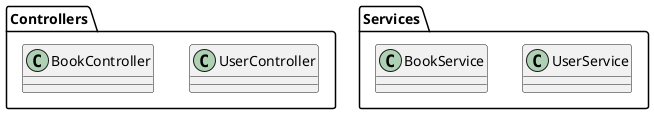

# CRUD Analyzer

Spring Boot + MyBatis プロジェクトの **Controller → Service → Mapper** の呼び出し関係を解析し、各エンドポイントが操作するテーブルとCRUD操作を可視化するツールです。

## 📋 主な機能

- **🔍 多層アーキテクチャ解析**: Controller → Service → Repository/Mapper の呼び出し関係を自動追跡
- **📊 MyBatis 完全対応**: XML マッピング、アノテーションベース、Generator 生成コードを統合解析
- **🎯 CRUD マトリクス生成**: エンドポイント × テーブル の操作関係を複数形式で可視化
- **⚡ 動的SQL対応**: `#{parameter}`, `${parameter}`, `<if>`, `<where>` 等の MyBatis 動的要素に対応
- **🛡️ エラー耐性**: 解析失敗時の正規表現フォールバック処理で高い成功率を実現
- **🔧 柔軟な設定**: 詳細な設定ファイルによる解析動作のカスタマイズ
- **📈 バッチジョブ解析**: Spring Batch のジョブ定義も解析対象に含む

## 🚀 環境構築

### 必要な環境
- **Java 21** 以上
- **Gradle** （Gradle Wrapper使用のため不要）

### 1. リポジトリのクローン
```bash
git clone https://github.com/conte0745/CRUD-Analyzer.git
cd CRUD-Analyzer
```

### 2. ビルド
```bash
./gradlew shadowJar
```

## ⚙️ 設定ファイル

アプリケーションの動作は `analyzer-config.properties` ファイルで詳細に設定できます。

### 設定可能な項目
- **基本ディレクトリ設定**: ソースコード、リソース、出力ディレクトリの指定
- **外部JAR設定**: 外部ライブラリのMyBatisマッピングファイル解析
- **ログ設定**: ログレベルの調整（TRACE, DEBUG, INFO, WARN, ERROR）
- **出力形式制御**: Markdown、PlantUML、JSON出力の個別ON/OFF
- **解析オプション**: MyBatis Generator対応、動的SQL解析、解析深度制限
- **パッケージフィルタ**: 解析対象の包含・除外パッケージ指定

## 📖 使い方

### 🎯 設定ファイルを使用した実行

#### 1. 設定ファイルの作成
```bash
# サンプル設定ファイルをコピー
cp analyzer-config.properties.example analyzer-config.properties
```

#### 2. 設定ファイルの編集
```properties
# analyzer-config.properties

# 基本ディレクトリ設定
src.directory=/path/to/your/project/src/main/java
resources.directory=/path/to/your/project/src/main/resources
output.directory=/path/to/your/project/docs

# 外部JARパス（オプション）
jar.paths=/opt/mybatis-libs:/home/user/external-jars

# ログ設定
log.level=INFO

# 出力形式の制御
output.markdown=true
output.plantuml=true
output.json=true

# 解析オプション
analysis.include.generated=true
analysis.include.dynamic.sql=true
analysis.max.depth=1000

# パッケージフィルタ
include.packages=
exclude.packages=test,example
```

#### 3. 実行方法
```bash
java -jar build/libs/crud-analyzer-all.jar
```

## 📊 出力ファイル

解析完了後、以下のファイルが出力されます：

### 1. `出力ディレクトリ/crud-matrix.md`

- エンドポイント × テーブル のCRUDマトリクス（Markdown形式）
- パッケージ毎にCRUDマトリクス（ディレクトリ下の`crud/[package]-crud-matrix.md`）を出力

```markdown
| Endpoint | users | books | book_genres |
|----------|-------|-------|-------------|
| POST /users | C | - | - |
| GET /users/{id} | R | - | - |
| PUT /users/{id} | U | - | - |
```

### 2. `出力ディレクトリ/crud.puml`

- PlantUML形式の関係図



### 3. `出力ディレクトリ/analysis.json`

- 詳細な解析結果（JSON形式）

```json
{
  "endpoints": [...],
  "calls": [...],
  "sqls": [...],
  "links": [...]
}
```

## 🔧 開発・メンテナンス

### コードフォーマット（Spotless）
Javaコードの整形には [Spotless](https://github.com/diffplug/spotless) を利用しています。

```bash
./gradlew spotlessApply   # コードを自動整形
./gradlew spotlessCheck   # 整形チェック（CI等で利用）
```

### ビルドとテスト
```bash
# 通常のビルド
./gradlew build

# 実行可能JARの作成
./gradlew shadowJar

# クリーンビルド
./gradlew clean build
```

## 🎯 対象プロジェクト要件

### 必須要件
- **Spring Boot** プロジェクト
- **MyBatis** を使用したデータアクセス層
- **Controller → Service → Mapper** のレイヤー構造

### 対応アノテーション

#### Spring Framework
- `@RestController`, `@Controller`
- `@RequestMapping`, `@GetMapping`, `@PostMapping`, `@PutMapping`, `@DeleteMapping`
- `@Service`, `@Component`
- `@Repository`

#### MyBatis
- `@Mapper`
- `@Select`, `@Insert`, `@Update`, `@Delete`
- `@SelectProvider`, `@InsertProvider`, `@UpdateProvider`, `@DeleteProvider`

#### Spring Batch
- `@JobScope`, `@StepScope`
- `@EnableBatchProcessing`

### 対応SQL構文
- **基本SQL**: SELECT, INSERT, UPDATE, DELETE
- **MyBatisパラメータ**: `#{parameter}`, `${parameter}`
- **動的SQL**: `<if>`, `<where>`, `<choose>`, `<when>`, `<otherwise>`, `<foreach>`
- **JOIN**: INNER JOIN, LEFT JOIN, RIGHT JOIN, FULL OUTER JOIN
- **複合クエリ**: UNION, INTERSECT, EXCEPT
- **サブクエリ**: EXISTS, IN, NOT IN
- **CTE**: WITH句（Common Table Expression）

## ⚙️ 高度な設定

### ログレベル調整
設定ファイルまたはシステムプロパティでログレベルを調整できます：

```properties
# analyzer-config.properties
log.level=DEBUG  # TRACE, DEBUG, INFO, WARN, ERROR
```

```bash
# システムプロパティでの指定
java -Droot.level=DEBUG -jar build/libs/crud-analyzer-all.jar
```

### 解析対象のカスタマイズ
```properties
# 特定のパッケージのみを解析対象とする
include.packages=com.example.controller,com.example.service

# テストコードを除外
exclude.packages=test,mock,example,demo

# MyBatis Generator生成コードを除外
analysis.include.generated=false

# 動的SQLを除外（静的SQLのみ解析）
analysis.include.dynamic.sql=false
```

### 外部JAR解析
```properties
# 外部ライブラリのMyBatisマッピングも解析
jar.paths=/opt/mybatis-libs:/home/user/external-jars
```

## 🔍 トラブルシューティング

### よくある問題

#### 1. 解析対象が見つからない
```
エラー: Controller/Service/Mapperが見つかりません
```
**解決策**: パッケージ構造とディレクトリパスを確認してください。

#### 2. MyBatis XMLが読み込めない
```
エラー: MyBatis XMLファイルが見つかりません
```
**解決策**: リソースディレクトリのパスが正しいか確認してください。

#### 3. SQL解析エラー
```
警告: SQL解析に失敗しました
```
**解決策**: 複雑なSQL文は正規表現フォールバックで処理されます。結果に影響はありません。

### デバッグ情報の取得
```bash
# 詳細ログで実行
java -Djava.util.logging.level=FINE -jar build/libs/crud-analyzer-all.jar
```

## 🏗️ アーキテクチャ

### 主要コンポーネント
- **ControllerScanner**: Spring Controller の解析（認知的複雑度最適化済み）
- **CallGraphScanner**: メソッド呼び出し関係の解析（認知的複雑度最適化済み）
- **MyBatisXmlScanner**: MyBatis XML ファイルの解析（認知的複雑度最適化済み）
- **MyBatisAnnotationScanner**: MyBatis アノテーションベースマッパーの解析
- **MyBatisGeneratorScanner**: MyBatis Generator 生成コードの解析
- **MyBatisClasspathScanner**: 外部JAR内のMyBatisマッピング解析
- **BatchJobScanner**: Spring Batch ジョブ定義の解析
- **SqlClassifier**: SQL文の分類とテーブル抽出（JSqlParser + 正規表現フォールバック）
- **出力モジュール**: Markdown, PlantUML, JSON形式での出力

### 解析フロー
1. **設定読み込み** → `analyzer-config.properties` から設定値を取得
2. **Javaソースコード解析** → エンドポイント、バッチジョブ、メソッド呼び出し関係を抽出
3. **MyBatis統合解析** → XML、アノテーション、Generator、外部JARからSQL文とテーブル操作を抽出
4. **関係性マッピング** → エンドポイント・バッチジョブとテーブル操作を関連付け
5. **結果出力** → 複数形式でCRUDマトリクスを生成

## 📝 制約とヒント

### 名前解決の制約
- **フィールド名 → 型名の簡易解決**（`private OrderService orderService;` のようにフィールドがあれば解決）
- **コンストラクタ注入**でも **フィールドが宣言されていれば** OK（`final` フィールドでの注入を想定）
- **名前解決は単純名一致**（`namespace` の末尾と `Mapper` のクラス名が一致すればマッチ）

### 技術的特徴
- **認知的複雑度最適化**: 主要スキャナークラスの複雑度を15未満に最適化済み
- **例外処理の改善**: 具体的な例外型による適切なエラーハンドリング
- **XXE攻撃対策**: XML解析時のセキュリティ対策を実装
- **メモリ効率**: ストリーム処理による大規模プロジェクト対応
